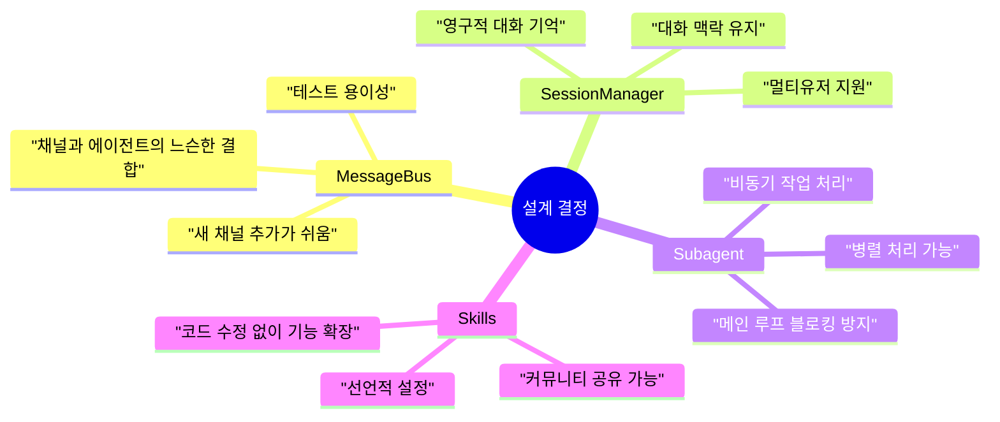
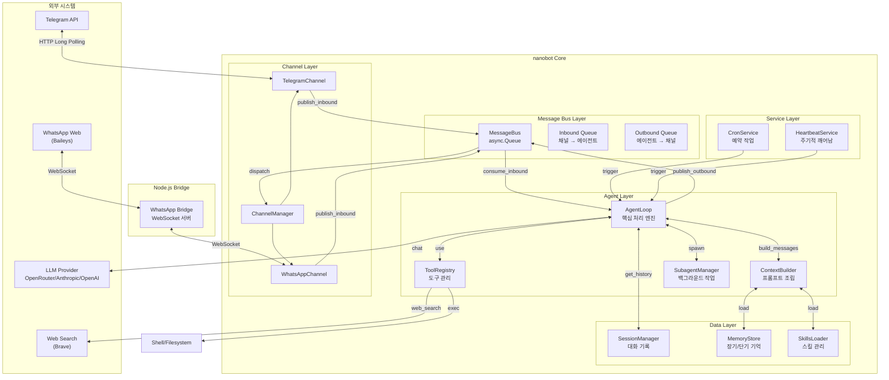
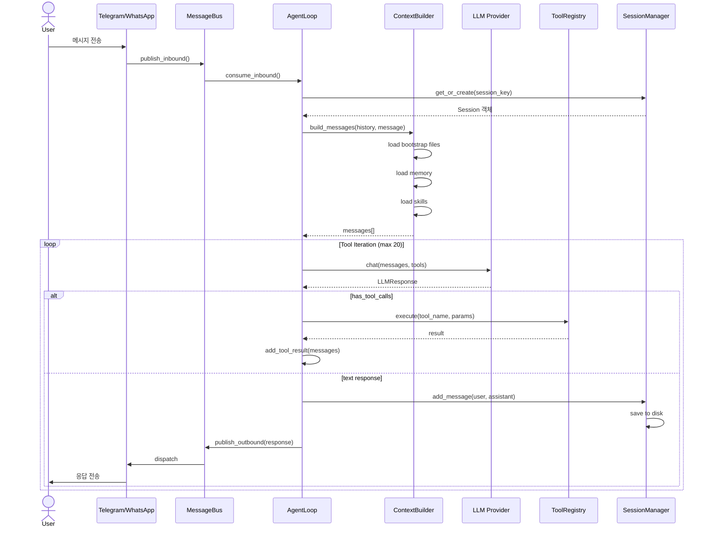
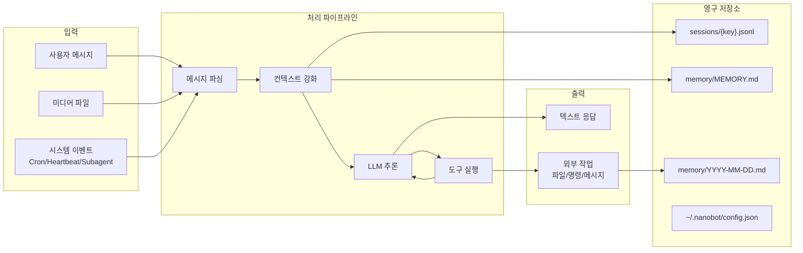
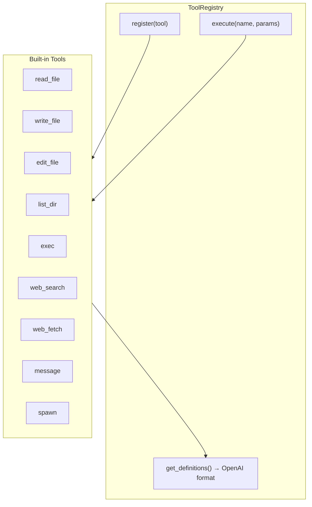
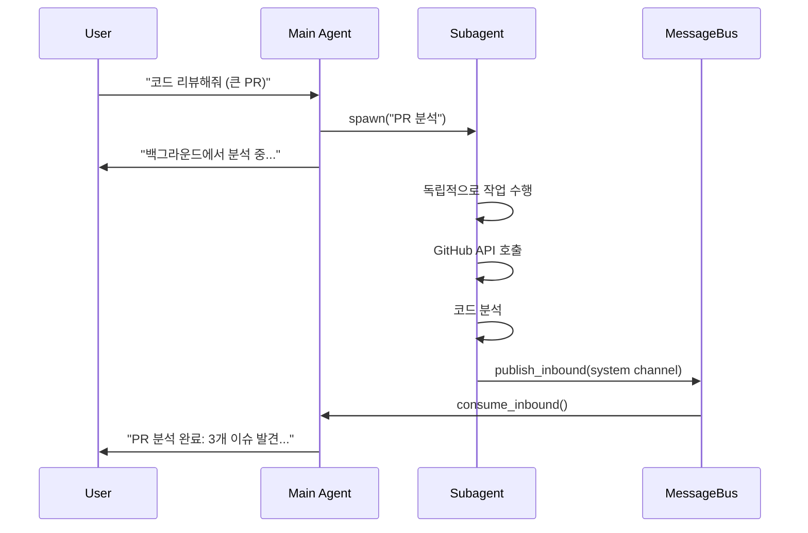
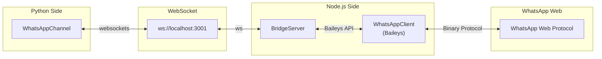

# nanobot 아키텍처 상세 문서

> **⚠️ 주의**: 이 문서는 nanobot의 설계 철학, 아키텍처 패턴, 그리고 각 컴포넌트가 어떻게 상호작용하는지를 아주 상세히 설명합니다. 개조를 위한 기초 자료로 활용하세요.

---

## 1. 설계 철학 (Design Philosophy)

### 1.1 핵심 원칙: "작지만 완전한" (Small but Complete)

nanobot은 Clawdbot(430k+ 라인)에서 영감을 받았지만, **핵심 기능만을 추출하여 ~4,000 라인**으로 구현했습니다. 이는 다음의 철학을 반영합니다:

```
┌─────────────────────────────────────────────────────────────┐
│  "복잡성은 적의 적이다"                                      │
│  - 불필요한 추상화 제거                                      │
│  - 직접 읽을 수 있는 코드                                    │
│  - 수정하고 확장하기 쉬운 구조                               │
└─────────────────────────────────────────────────────────────┘
```

### 1.2 아키텍처 원칙

| 원칙 | 설명 | 구현 예시 |
|------|------|-----------|
| **단일 책임** | 각 모듈은 하나의 역할만 | `AgentLoop`는 오직 메시지 처리만 |
| **의존성 역전** | 구체가 아닌 추상에 의존 | `LLMProvider` 추상 클래스 |
| **메시지 버스** | 컴포넌트 간 느슨한 결합 | `MessageBus`를 통한 통신 |
| **컨텍스트 격리** | 세션별 독립적인 상태 관리 | `SessionManager`로 분리 |
| **프로그레시브 로딩** | 필요할 때만 스킬 로드 | SkillsLoader의 lazy loading |

### 1.3 왜 이런 구조를 선택했는가?



---

## 2. 전체 아키텍처 다이어그램

### 2.1 시스템 전체 구조



### 2.2 메시지 흐름 (Request Lifecycle)



### 2.3 데이터 흐름 (Data Flow)



---

## 3. 핵심 컴포넌트 상세 분석

### 3.1 MessageBus - 시스템의 혈관

```python
# nanobot/bus/queue.py
class MessageBus:
    """
    비동기 메시지 버스 - 모든 컴포넌트의 통신 중심
    
    설계 의도:
    1. 채널과 에이전트의 완전한 분리
    2. 새로운 채널 추가가 기존 코드 수정 없이 가능
    3. 테스트 시 목(mock)으로 대체 가능
    """
    
    def __init__(self):
        self.inbound: asyncio.Queue[InboundMessage] = asyncio.Queue()
        self.outbound: asyncio.Queue[OutboundMessage] = asyncio.Queue()
        self._outbound_subscribers: dict[str, list[Callable]] = {}
```

**왜 Queue를 사용하는가?**
- **비동기 처리**: 채널은 메시지를 보내고 즉시 반환, 에이전트는 자신의 속도로 처리
- **버퍼링**: 순간적인 트래픽 증가에도 시스템 안정성 유지
- **백프레셔**: Queue 크기로 부하 제어 가능

### 3.2 AgentLoop - 핵심 처리 엔진

```python
# nanobot/agent/loop.py
class AgentLoop:
    """
    ReAct 패턴 구현: Reasoning + Acting
    
    동작 방식:
    1. 사용자 입력 수신
    2. 컨텍스트 조립 (시스템 프롬프트 + 히스토리 + 메모리 + 스킬)
    3. LLM 호출
    4. 도구 호출이 있으면 실행하고 3으로 돌아감
    5. 최종 응답 반환
    """
    
    async def _process_message(self, msg: InboundMessage) -> OutboundMessage | None:
        # 세션 관리: 대화 맥락 유지
        session = self.sessions.get_or_create(msg.session_key)
        
        # 컨텍스트 빌드: 모든 정보를 LLM 형식으로 변환
        messages = self.context.build_messages(
            history=session.get_history(),
            current_message=msg.content,
        )
        
        # ReAct 루프
        while iteration < self.max_iterations:
            response = await self.provider.chat(messages, tools)
            
            if response.has_tool_calls:
                # 도구 실행 및 결과 추가
                for tool_call in response.tool_calls:
                    result = await self.tools.execute(tool_call.name, tool_call.arguments)
                    messages = self.context.add_tool_result(messages, tool_call.id, result)
            else:
                # 최종 응답
                return OutboundMessage(...)
```

**ReAct 패턴의 핵심:**
```
사용자: "날씨 어때?"
     ↓
LLM: 날씨 확인 필요 → web_search 호출
     ↓
도구: 검색 결과 반환
     ↓
LLM: 결과 분석 → 최종 응답 생성
     ↓
사용자: "서울은 맑음, 15도"
```

### 3.3 ContextBuilder - 프롬프트 엔지니어링의 핵심

```python
# nanobot/agent/context.py
class ContextBuilder:
    """
    시스템 프롬프트를 동적으로 조립
    
    계층적 구조:
    1. Core Identity (nanobot의 기본 정체성)
    2. Bootstrap Files (AGENTS.md, SOUL.md, USER.md)
    3. Memory (장기/단기 기억)
    4. Skills (활성화된 스킬)
    """
    
    BOOTSTRAP_FILES = ["AGENTS.md", "SOUL.md", "USER.md", "TOOLS.md", "IDENTITY.md"]
    
    def build_system_prompt(self) -> str:
        parts = []
        parts.append(self._get_identity())  # 기본 정체성
        parts.append(self._load_bootstrap_files())  # 사용자 정의
        parts.append(self.memory.get_memory_context())  # 기억
        parts.append(self.skills.load_skills_for_context(...))  # 스킬
        return "\n\n---\n\n".join(parts)
```

**프롬프트 구조 시각화:**
```
┌────────────────────────────────────────────────────────┐
│ # nanobot 🐈                                          │
│ You are nanobot, a helpful AI assistant...            │
├────────────────────────────────────────────────────────┤
│ ## AGENTS.md                                          │
│ (사용자가 정의한 에이전트 지침)                        │
├────────────────────────────────────────────────────────┤
│ ## SOUL.md                                            │
│ (성격, 가치관 정의)                                    │
├────────────────────────────────────────────────────────┤
│ ## Memory                                             │
│ ### Long-term Memory                                  │
│ (중요한 기억)                                          │
│ ### Today's Notes                                     │
│ (오늘의 기록)                                          │
├────────────────────────────────────────────────────────┤
│ ## Active Skills                                      │
│ (현재 활성화된 스킬들)                                 │
└────────────────────────────────────────────────────────┘
```

### 3.4 Tool System - 확장 가능한 도구 아키텍처

```python
# nanobot/agent/tools/base.py
class Tool(ABC):
    """
    모든 도구의 기본 클래스
    
    OpenAI Function Calling 형식과 호환되는 스키마 생성
    """
    
    @property
    @abstractmethod
    def name(self) -> str: ...
    
    @property
    @abstractmethod
    def description(self) -> str: ...
    
    @property
    @abstractmethod
    def parameters(self) -> dict[str, Any]: ...
    
    @abstractmethod
    async def execute(self, **kwargs: Any) -> str: ...
```

**도구 등록 및 실행 흐름:**


### 3.5 Subagent - 병렬 처리의 핵심

```python
# nanobot/agent/subagent.py
class SubagentManager:
    """
    백그라운드 작업을 위한 경량 에이전트
    
    사용 시나리오:
    1. 오래 걸리는 작업 (빌드, 배포)
    2. 독립적인 조사/리서치
    3. 병렬 처리가 필요한 경우
    
    제약사항:
    - message 도구 없음 (직접 사용자와 통신 불가)
    - spawn 도구 없음 (중첩 불가)
    - 독립적인 컨텍스트
    """
    
    async def spawn(self, task: str, label: str, origin_channel: str, origin_chat_id: str) -> str:
        # 백그라운드 태스크 생성
        bg_task = asyncio.create_task(
            self._run_subagent(task_id, task, display_label, origin)
        )
        
    async def _run_subagent(self, ...):
        # 완료 후 결과를 메인 에이전트에 알림
        await self._announce_result(task_id, label, task, final_result, origin, "ok")
```

**Subagent 통신 흐름:**


### 3.6 Memory System - 기억의 계층 구조

```python
# nanobot/agent/memory.py
class MemoryStore:
    """
    2계층 메모리 시스템
    
    1. 단기 기억 (Daily Notes): memory/YYYY-MM-DD.md
       - 당일의 대화, 작업 기록
       - 자동으로 날짜별로 분리
    
    2. 장기 기억 (Long-term): memory/MEMORY.md
       - 중요한 사실, 사용자 정보
       - 명시적으로 기록/수정
    """
    
    def get_recent_memories(self, days: int = 7) -> str:
        """최근 N일간의 기억 조회"""
        
    def get_memory_context(self) -> str:
        """LLM 컨텍스트용 메모리 포맷팅"""
```

### 3.7 Skills System - 선언적 기능 확장

```markdown
---
# SKILL.md 프론트매터 (메타데이터)
name: github
description: "GitHub CLI 사용법"
metadata: {"nanobot":{"requires":{"bins":["gh"]},"always":false}}
---

# 실제 스킬 내용
gh pr list --repo owner/repo
...
```

```python
# nanobot/agent/skills.py
class SkillsLoader:
    """
    스킬 시스템의 핵심
    
    Progressive Loading:
    1. always=true 스킬: 항상 컨텍스트에 포함
    2. 나머지 스킬: 목록만 제공, 필요시 read_file로 로드
    
    이유: 토큰 절약 + 관련 없는 스킬로 인한 혼란 방지
    """
    
    def build_skills_summary(self) -> str:
        """XML 형식의 스킬 목록 생성"""
        
    def _check_requirements(self, skill_meta: dict) -> bool:
        """바이너리/환경변수 요구사항 체크"""
```

---

## 4. 채널 아키텍처

### 4.1 채널 추상화

```python
# nanobot/channels/base.py
class BaseChannel(ABC):
    """
    모든 채널의 공통 인터페이스
    
    새로운 채널 추가 방법:
    1. BaseChannel 상속
    2. start(), stop(), send() 구현
    3. ChannelManager에 등록
    """
    
    @abstractmethod
    async def start(self) -> None: ...
    
    @abstractmethod
    async def stop(self) -> None: ...
    
    @abstractmethod
    async def send(self, msg: OutboundMessage) -> None: ...
```

### 4.2 WhatsApp Bridge 아키텍처



**왜 Node.js Bridge가 필요한가?**
- Baileys(WhatsApp Web 라이브러리)가 Node.js 전용
- Python의 whatsapp-web.js 대안이 불안정
- WebSocket으로 언어 간 통신

---

## 5. 서비스 레이어

### 5.1 Cron Service

```python
# nanobot/cron/service.py
class CronService:
    """
    3가지 스케줄링 방식 지원:
    
    1. "at": 특정 시간에 한 번 실행
       nanobot cron add --at "2025-02-03T09:00:00"
    
    2. "every": 주기적 실행
       nanobot cron add --every 3600
    
    3. "cron": Cron 표현식
       nanobot cron add --cron "0 9 * * *"
    """
```

### 5.2 Heartbeat Service

```python
# nanobot/heartbeat/service.py
class HeartbeatService:
    """
    주기적으로 에이전트를 "깨우는" 서비스
    
    사용법:
    1. workspace/HEARTBEAT.md에 할 일 작성
    2. 30분마다 에이전트가 파일 읽고 작업 수행
    3. HEARTBEAT_OK 응답시 아무것도 안함
    
    활용 예시:
    - 정기적인 데이터 수집
    - 모니터링 및 알림
    - 자동화된 보고서 생성
    """
```

---

## 6. 데이터 흐름 상세

### 6.1 세션 저장 구조

```
~/.nanobot/sessions/
├── telegram_123456789.jsonl    # Telegram 세션
├── whatsapp_821012345678.jsonl # WhatsApp 세션
└── cli_default.jsonl           # CLI 세션

# 파일 형식 (JSONL)
{"_type":"metadata","created_at":"2025-02-02T10:00:00",...}
{"role":"user","content":"Hello","timestamp":"2025-02-02T10:00:01"}
{"role":"assistant","content":"Hi!","timestamp":"2025-02-02T10:00:02"}
```

### 6.2 설정 파일 구조

```json
{
  "agents": {
    "defaults": {
      "model": "anthropic/claude-opus-4-5",
      "maxToolIterations": 20
    }
  },
  "providers": {
    "openrouter": { "apiKey": "sk-or-..." },
    "anthropic": { "apiKey": "sk-ant-..." }
  },
  "channels": {
    "telegram": { "enabled": true, "token": "..." },
    "whatsapp": { "enabled": false }
  }
}
```

---

## 7. 확장 가이드

### 7.1 새로운 도구 추가

```python
# nanobot/agent/tools/my_tool.py
from nanobot.agent.tools.base import Tool

class MyTool(Tool):
    @property
    def name(self) -> str:
        return "my_tool"
    
    @property
    def description(self) -> str:
        return "설명"
    
    @property
    def parameters(self) -> dict[str, Any]:
        return {
            "type": "object",
            "properties": {
                "param": {"type": "string"}
            },
            "required": ["param"]
        }
    
    async def execute(self, param: str, **kwargs) -> str:
        return f"Result: {param}"

# AgentLoop._register_default_tools()에 등록
```

### 7.2 새로운 채널 추가

```python
# nanobot/channels/discord.py
from nanobot.channels.base import BaseChannel

class DiscordChannel(BaseChannel):
    name = "discord"
    
    async def start(self) -> None:
        # Discord bot 연결
        pass
    
    async def stop(self) -> None:
        # 연결 종료
        pass
    
    async def send(self, msg: OutboundMessage) -> None:
        # 메시지 전송
        pass
```

### 7.3 새로운 스킬 추가

```markdown
# ~/.nanobot/workspace/skills/my_skill/SKILL.md
---
name: my_skill
description: "내 스킬 설명"
metadata: {"nanobot":{"requires":{"bins":["my_binary"]}}}
---

# 스킬 사용법
...
```

---

## 8. 핵심 디자인 패턴 요약

| 패턴 | 위치 | 목적 |
|------|------|------|
| **ReAct** | AgentLoop | 추론-행동 반복 |
| **Message Bus** | MessageBus | 느슨한 결합 |
| **Repository** | SessionManager, MemoryStore | 데이터 추상화 |
| **Strategy** | LLMProvider | 다중 제공자 지원 |
| **Template Method** | BaseChannel | 채널 일관성 |
| **Progressive Loading** | SkillsLoader | 효율적 컨텍스트 관리 |
| **Subagent** | SubagentManager | 병렬 처리 |

---

## 9. 개조를 위한 아이디어

### 9.1 쉬운 확장

1. **새로운 LLM Provider 추가**
   - `LLMProvider` 상속 → `OllamaProvider`, `LocalProvider`

2. **RAG 시스템 통합**
   - `MemoryStore` 확장 → 벡터 DB 연동

3. **멀티모달 지원**
   - `ContextBuilder._build_user_content()` 확장
   - 비디오/오디오 처리 도구 추가

### 9.2 구조 변경

1. **분산 처리**
   - MessageBus를 Redis/Kafka로 교체
   - 여러 에이전트 인스턴스 공유

2. **플러그인 시스템**
   - 동적 도구 로딩 (현재는 정적 등록)
   - 외부 스크립트 실행 도구

3. **보안 강화**
   - 도구 실행 샌드박싱
   - 권한 시스템 추가

---

> **마지막 팁**: nanobot의 핵심은 **단순함**입니다. 수정할 때는 항상 "이게 정말 필요한가?"를 물어보세요. 작은 코드가 큰 힘을 발휘합니다. 🐈
