# nanobot Mermaid 다이어그램 모음

> 개조 및 문서화를 위해 분리된 다이어그램들입니다.

---

## 1. 전체 시스템 아키텍처

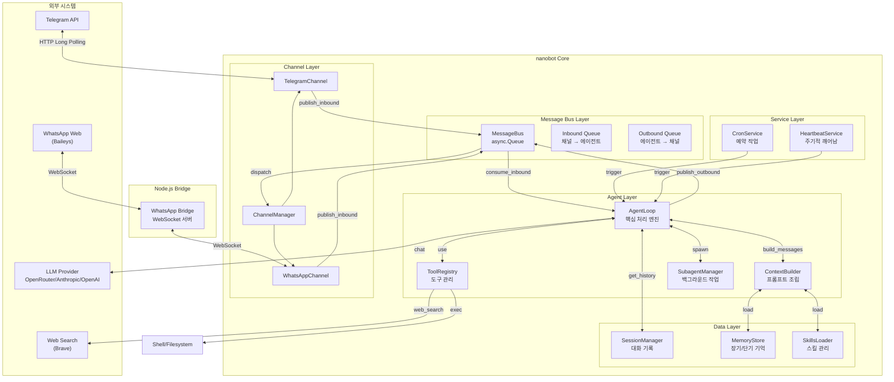

---

## 2. 메시지 처리 흐름 (Request Lifecycle)

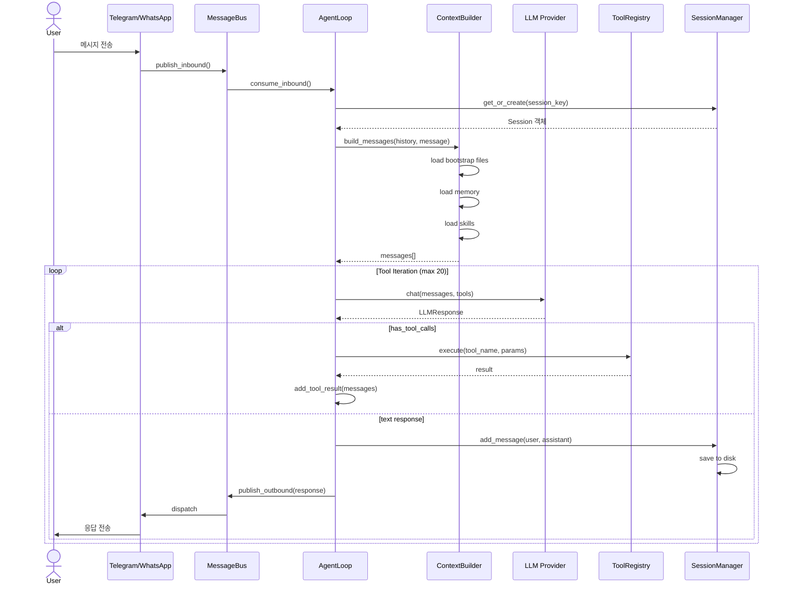

---

## 3. ReAct 패턴 상세

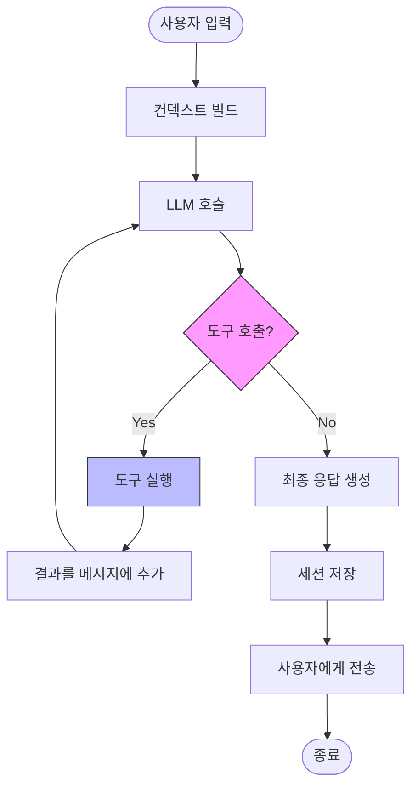

---

## 4. 데이터 흐름

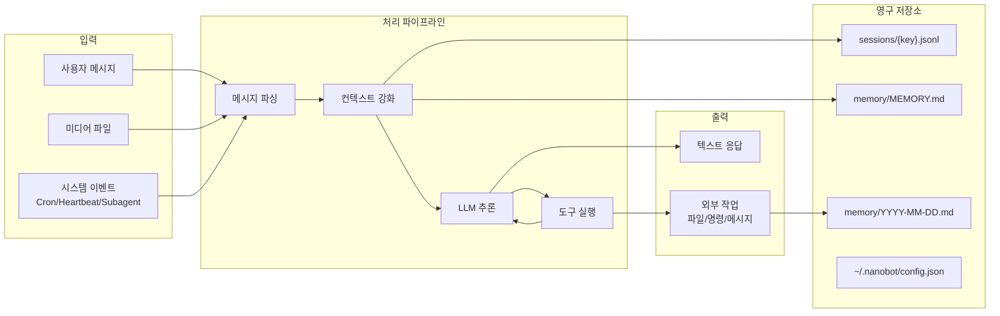

---

## 5. 컨텍스트 빌드 구조

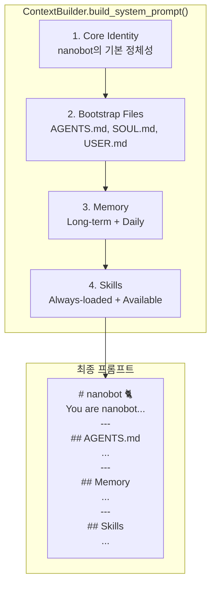

---

## 6. 메모리 시스템

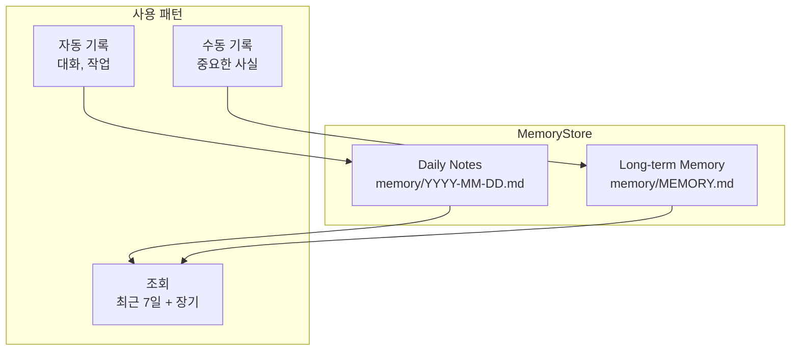

---

## 7. 스킬 시스템

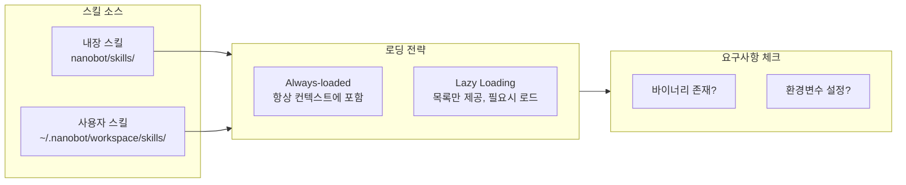

---

## 8. 도구 레지스트리

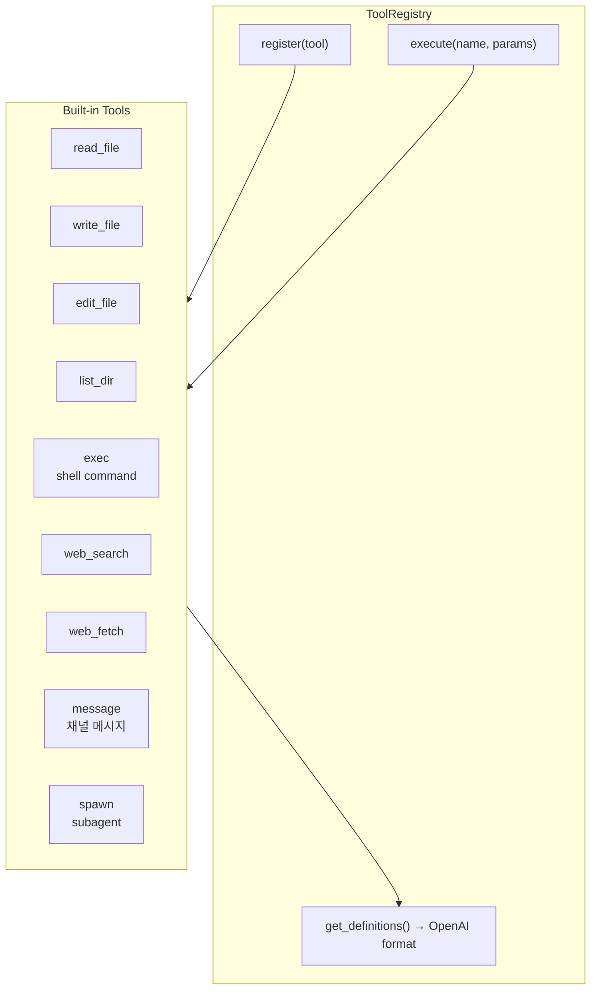

---

## 9. Subagent 통신 흐름

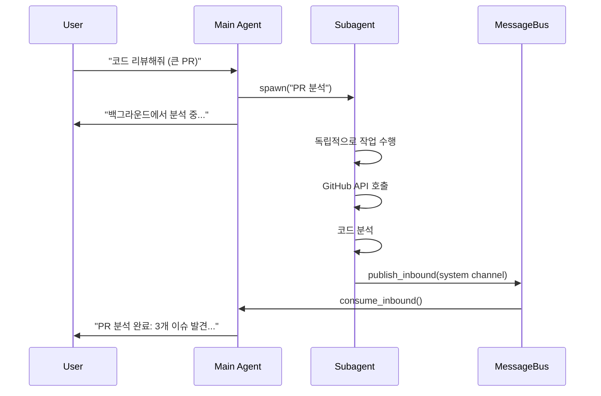

---

## 10. WhatsApp Bridge 아키텍처

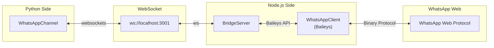

---

## 11. Cron 서비스

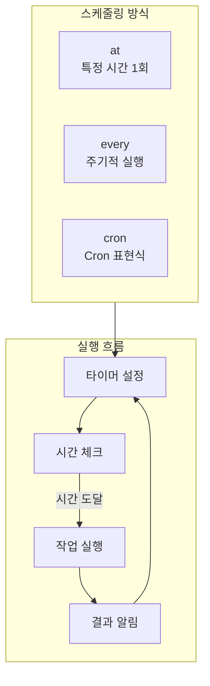

---

## 12. Heartbeat 서비스

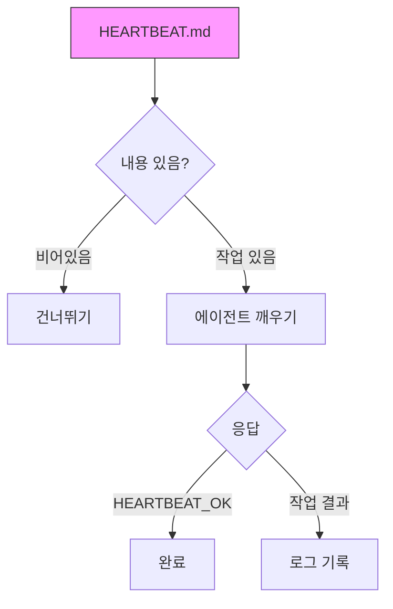

---

## 13. 세션 저장 구조

```mermaid
flowchart TB
    subgraph SessionDir["~/.nanobot/sessions/"]
        File1["telegram_123456789.jsonl"]
        File2["whatsapp_821012345678.jsonl"]
        File3["cli_default.jsonl"]
    end
    
    subgraph Format["파일 형식 (JSONL)"]
        Meta["{"_type":"metadata",...}"]
        Msg1["{"role":"user",...}"]
        Msg2["{"role":"assistant",...}"]
    end
    
    File1 --> Format
```

---

## 14. 클래스 의존성 다이어그램

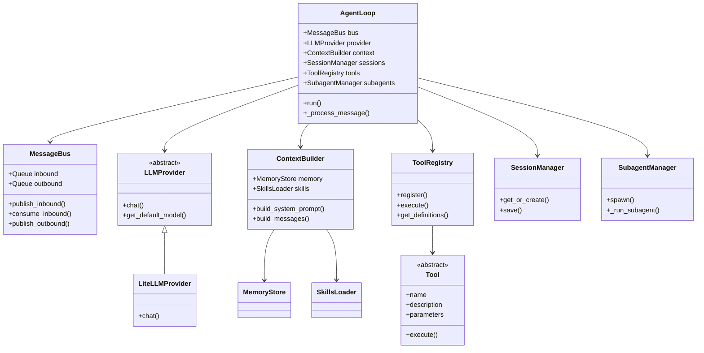

---

## 15. 모듈 의존성 그래프

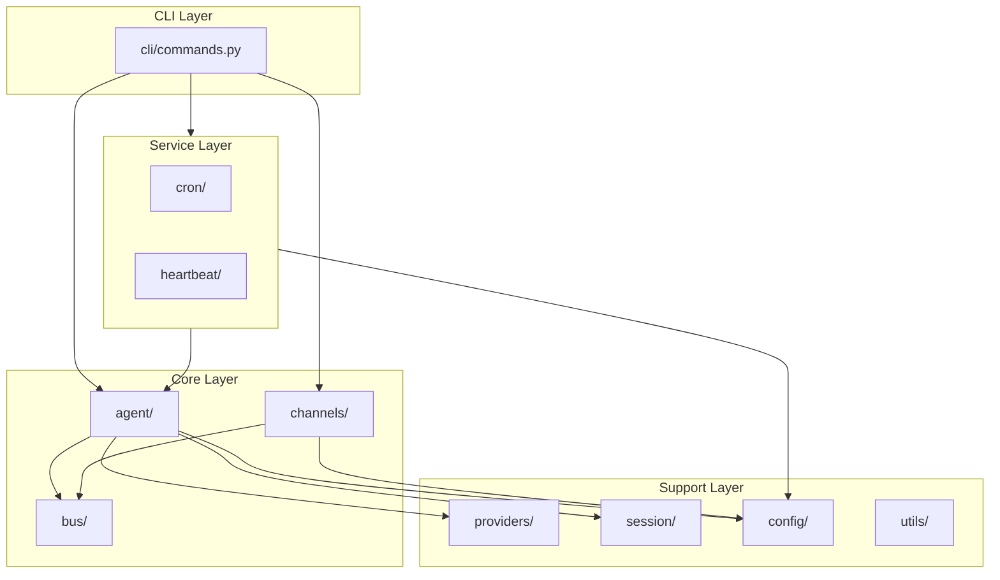

---

## 16. 상태 머신: 에이전트 처리 상태

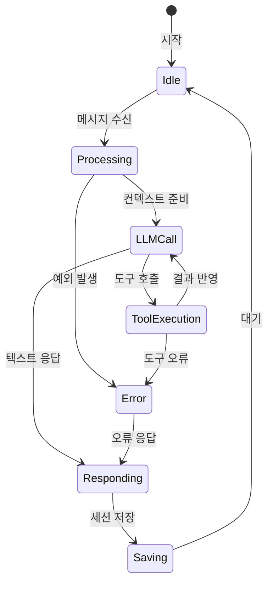

---

## 17. 배포 아키텍처

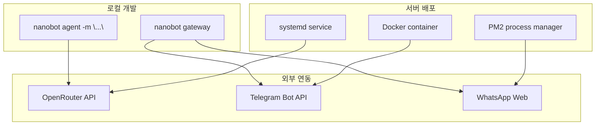

---

> 💡 **팁**: Mermaid 다이어그램은 GitHub, Notion, Obsidian 등에서 직접 렌더링됩니다.
